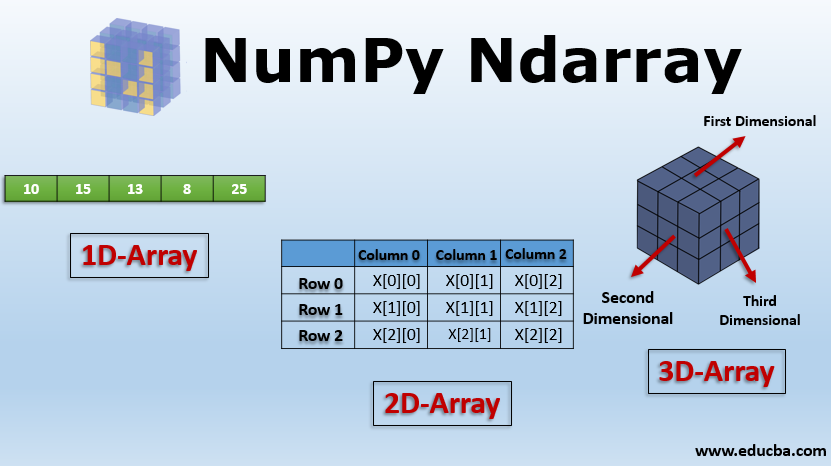

# Guía de Uso de NumPy

## ¿Qué es NumPy?

NumPy es un módulo de Python que significa "Python Numérico". Esta biblioteca es esencial para la computación científica y numérica, ya que proporciona herramientas y estructuras eficientes para trabajar con matrices multidimensionales y realizar operaciones matemáticas y numéricas de manera rápida. Escrito principalmente en C, NumPy garantiza una ejecución de alta velocidad para las operaciones matemáticas y numéricas.

## Características Principales

- Proporciona un objeto de matriz multidimensional de alto rendimiento.
- Es esencial para la computación científica en Python.
- Puede ser utilizado como un contenedor eficiente de datos multidimensionales.
- Se basa en módulos anteriores de Python como Numeric y Numarray.

## ndarray - Matriz Multidimensional

El núcleo de NumPy es el objeto ndarray (matriz multidimensional). Las matrices ndarray permiten almacenar y manipular datos en varias dimensiones. Puedes crear matrices usando funciones como `numpy.array()`, y luego realizar operaciones matemáticas y manipulaciones en estas matrices.

## Slicing - Acceso a Subconjuntos

Una de las características poderosas de NumPy es el acceso a subconjuntos de datos en matrices utilizando la técnica de "slicing". Puedes seleccionar porciones específicas de una matriz multidimensional utilizando índices y rangos. Esto es extremadamente útil para extraer datos específicos sin la necesidad de bucles complicados.

## Operaciones con NumPy

NumPy ofrece una amplia gama de operaciones matemáticas y lógicas en matrices, lo que lo hace ideal para cálculos científicos y de ingeniería. Algunas de las funcionalidades clave incluyen:

- Transformaciones de Fourier para análisis de señales y espectros.
- Operaciones de álgebra lineal como multiplicación de matrices, resolución de sistemas de ecuaciones y cálculo de determinantes.
- Generación de números aleatorios para simulaciones y experimentos.

## Conclusión

NumPy es una herramienta esencial para cualquier persona que trabaje con datos científicos y numéricos en Python. Proporciona un rendimiento excepcional para cálculos matemáticos y numéricos y ofrece una amplia variedad de funcionalidades para el análisis de datos y la simulación. Ya sea que estés realizando investigaciones científicas o desarrollando aplicaciones de análisis de datos, NumPy te brinda las herramientas necesarias para llevar a cabo operaciones complejas de manera eficiente y efectiva.
